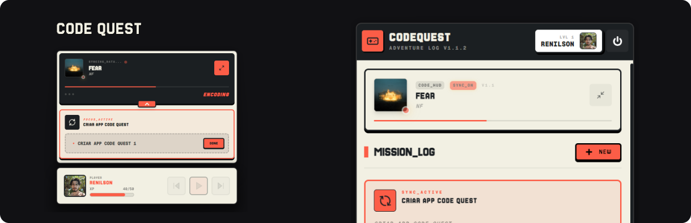

# CodeQuest 🎮⚔️

> Transforme suas tarefas em uma aventura épica com gamificação e integração Spotify

CodeQuest é um gerenciador de tarefas gamificado que transforma sua produtividade em uma jornada de RPG. Complete missões (quests), ganhe XP, suba de nível e sincronize suas tarefas com suas músicas favoritas do Spotify.

<div width="100%" align="center">
  
</div>

<div width="100%" style="display: flex; justify-content: center; margin-top: 40px; margin-bottom: 40px;">
  <a href="https://github.com/renilson-medeiros/codequest/releases/latest/download/CodeQuest-v1.0.0-portable.zip">
    
  </a>
</div>

---

## ✨ Características

- 🎯 **Sistema de Quests** - Organize tarefas como missões de RPG com checkpoints
- 🎵 **Integração Spotify** - Sincronize quests com playlists e controle a reprodução
- 💎 **Sistema de XP & Níveis** - Ganhe experiência ao completar tarefas
- 🎨 **Temas Personalizáveis** - 6 temas retrô/pixel art (Dourado, Roxo, Ciano, Verde, Rosa, Vermelho)
- 🖼️ **Perfil Customizável** - Avatar, estatísticas e progresso visual
- 🎮 **Design Retro/Pixel** - Interface inspirada em jogos clássicos
- 📊 **Modo Focus** - Visualização minimalista para concentração máxima
- 🪟 **Player Window** - Janela secundária com controles de música (Premium)

---

## 🛠️ Tecnologias

### Backend

- **Python 3.10+** - Linguagem principal
- **FastAPI** - Framework web assíncrono
- **Uvicorn** - Servidor ASGI
- **SQLite** - Banco de dados local
- **aiosqlite** - Driver assíncrono para SQLite
- **Spotify Web API** - Integração com Spotify

### Frontend

- **React 18** - Biblioteca UI
- **Vite** - Build tool e dev server
- **Electron** - Framework desktop multiplataforma
- **Tailwind CSS** - Framework CSS utilitário
- **Framer Motion** - Animações
- **Lucide React** - Ícones
- **Axios** - Cliente HTTP

### Ferramentas

- **Concurrently** - Execução paralela de processos
- **Wait-on** - Sincronização de inicialização

---

---

## 🚀 Como Usar (Versão Portátil)

A forma mais fácil de usar o CodeQuest no Windows é através da versão portátil:

1.  **Baixe** o arquivo `CodeQuest-vX.X.X-portable.zip` na aba de [Releases](https://github.com/renilson-medeiros/codequest/releases).
2.  **Extraia** para qualquer pasta.
3.  **Execute** o arquivo `CodeQuest.exe`.
4.  **Pronto!** Não precisa instalar nada (Python e Node.js já estão inclusos no pacote).

> [!IMPORTANT]
> Seus dados e progresso são salvos automaticamente na pasta `data/` dentro da pasta do aplicativo. Para atualizar o app, baixe a nova versão e mova sua pasta `data/` atual para a nova pasta.

---

## 🛠️ Configuração para Desenvolvedores

Se você deseja modificar o código ou contribuir para o projeto:

### 1. Requisitos de Desenvolvimento

- **Node.js** 18+ e npm
- **Python** 3.10+
- **Conta Spotify** (Premium para controles de reprodução)

### 2. Configuração do Ambiente

1.  **Clone o repositório**:

    ```bash
    git clone https://github.com/renilson-medeiros/codequest.git
    cd codequest
    ```

2.  **Configure o Backend**:
    - Entre na pasta `backend`.
    - Crie um ambiente virtual: `python -m venv venv`.
    - Instale as dependências: `pip install -r requirements.txt`.
    - Crie um arquivo `.env` (use `.env.example` como base).

3.  **Configure o Frontend**:
    - Entre na pasta `frontend`.
    - Instale as dependências: `npm install`.

### 3. Executando em Desenvolvimento

Na pasta raiz do projeto, você pode rodar:

```bash
npm start
```

### 4. Gerando a Versão Portátil

Para gerar um novo pacote `.zip` para o Windows:

```batch
scripts\build-portable.bat
```

---

## 🎮 Como Usar

1. **Login Spotify** - Faça login na primeira execução
2. **Criar Quest** - Clique no `+` para criar uma nova missão
3. **Adicionar Checkpoints** - Divida a quest em etapas menores
4. **Sincronizar Música** - Vincule uma playlist do Spotify à quest
5. **Completar Tarefas** - Marque checkpoints como concluídos e ganhe XP
6. **Modo Focus** - Ative para visualização minimalista durante trabalho

---

## 📁 Estrutura do Projeto

```
codequest/
├── backend/              # API Python/FastAPI
│   ├── main.py          # Endpoints e lógica principal
│   ├── database.py      # Gerenciamento SQLite
│   └── requirements.txt # Dependências Python
├── frontend/            # Aplicação Electron/React
│   ├── src/            # Código-fonte React
│   ├── electron.js     # Processo principal Electron
│   ├── preload.js      # Script de preload
│   └── package.json    # Dependências Node
└── doc/                # Documentação (gitignored)
```

---

## 🎨 Sistema de XP

- **+5 XP** por checkpoint completado
- **+25 XP** por quest completada
- **Leveling dinâmico** - Cada nível requer +25 XP a mais que o anterior
  - Nível 1→2: 50 XP
  - Nível 2→3: 75 XP
  - Nível 3→4: 100 XP

---

## 🔮 Roadmap

- [ ] Sistema de conquistas (achievements)
- [ ] Temas desbloqueáveis por nível
- [ ] Companions animados (pets pixel art)
- [ ] Estatísticas e gráficos de produtividade
- [ ] Sincronização em nuvem
- [ ] Versão mobile

---

## 🤝 Contribuindo

Contribuições são bem-vindas! Por favor:

1. Fork o projeto
2. Crie uma branch para sua feature (`git checkout -b feature/MinhaFeature`)
3. Commit suas mudanças (`git commit -m 'feat: Adiciona MinhaFeature'`)
4. Push para a branch (`git push origin feature/MinhaFeature`)
5. Abra um Pull Request

---

## 👤 Autor

**Renilson Medeiros**

- GitHub: [@renilson-medeiros](https://github.com/renilson-medeiros)

---

## 🙏 Agradecimentos

- Design inspirado em jogos clássicos de RPG
- Comunidade Spotify Developers
- Electron e React communities

---

<div align="center">
  
**Transforme tarefas em aventuras. Comece sua jornada hoje! ⚔️**

</div>
